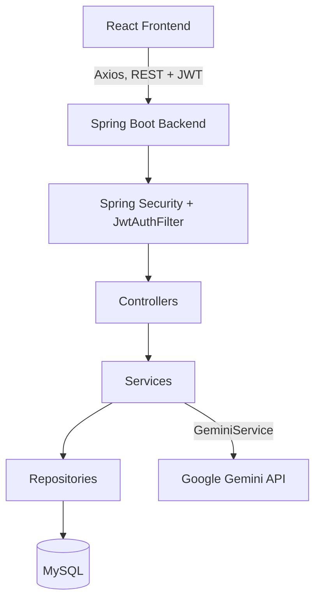
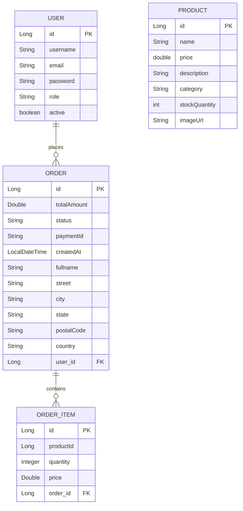

# TimeX

A full-stack watch e-commerce app built with React and Spring Boot. Customers can browse the catalog, add items to a cart, check out, and track their orders. Admins manage products and order statuses and get a quick look at sales numbers. There's also an AI Watch Finder: describe what you're looking for in natural language and Gemini picks out matching products for you.

## Overview

**For customers**
- Register and log in with JWT auth
- Browse products and view product detail pages
- Add to cart and check out (cart state lives in Redux Toolkit)
- Place orders with a delivery address
- View your own order history
- Ask the AI Watch Finder for recommendations in natural language

**For admins**
- Create, edit, and delete products, with image upload
- View all orders and update their status
- Check total revenue, orders, products, and users on a simple analytics view

**How the AI Watch Finder actually works:** your query and the entire product catalog get bundled into one prompt sent to Gemini, which replies with a short JSON list of matching product IDs and reasons. No embeddings, no vector search, no RAG, just one prompt per request.

---

## Tech Stack

| Layer | Technologies |
|---|---|
| Frontend | React , React Router , Redux Toolkit , Axios , Tailwind CSS , Lucide React  |
| Backend | Java 21, Spring Boot 4.1.0 (Web MVC, Data JPA, Security, Validation), Maven |
| Auth | JWT via `jjwt`  |
| Database | MySQL, via `mysql-connector-j` |
| AI | Google Gemini API via the `com.google.genai` SDK 1.16.0, model `gemini-3.6-flash` |

---

## Architecture



The React frontend talks to the Spring Boot API over Axios, attaching a JWT to every authenticated request. Each request first passes through a custom `JwtAuthFilter`, then hits a controller, which hands off to a service, which hands off to a repository, which talks to MySQL. The AI Watch Finder is the only feature that steps outside this loop to call an external API.

---

## Project Structure

```
timex-spring/
├── backend/
│   ├── src/
│   │   ├── main/
│   │   │   ├── java/com/timex/timex_backend/
│   │   │   │   ├── config/         # SecurityConfig, CorsConfig, WebConfig
│   │   │   │   ├── controller/     # AuthController, ProductController, OrderController,
│   │   │   │   │                   # AnalyticsController, AIController, TestController
│   │   │   │   ├── dto/            # RegisterRequest, LoginRequest, AuthResponse,
│   │   │   │   │                   # OrderRequest, OrderItemRequest, AddressRequest
│   │   │   │   ├── entity/         # User, Product, Order, OrderItem
│   │   │   │   ├── repository/     # UserRepository, ProductRepository,
│   │   │   │   │                   # OrderRepository, OrderItemRepository
│   │   │   │   ├── security/       # JwtAuthFilter, JwtUtil, CustomUserDetailsService
│   │   │   │   └── service/        # ProductService, OrderService, AnalyticsService, GeminiService
│   │   │   └── resources/
│   │   │       ├── application.properties
│   │   │       └── static/images/  # pre-seeded product images, served at /images/**
│   │   └── test/java/.../TimexBackendApplicationTests.java
│   ├── seed-images/         # sample images used by seed-products.sh
│   ├── uploads/             # runtime destination for admin-uploaded images
│   ├── Dockerfile
│   └── pom.xml
│
├── frontend/
│   ├── src/
│   │   ├── api/axios.js            # Axios instance, attaches JWT from localStorage
│   │   ├── components/
│   │   │   ├── AdminLayout.jsx, AdminRoute.jsx, AdminSidebar.jsx
│   │   │   ├── AIWatchFinder.jsx   # AI Watch Finder overlay panel
│   │   │   ├── Footer.jsx, Navbar.jsx
│   │   ├── context/AuthContext.js  # auth state via React Context
│   │   ├── pages/                  # Home, Shop, ProductDetail, Cart, Checkout, Login,
│   │   │                           # Signup, MyOrders, About, Contact, admin/*
│   │   ├── redux/cartSlice.js, store.js   # cart state only
│   │   ├── styles/global.css
│   │   └── App.jsx
│   └── package.json
│
└── seed-products.sh          # curl script to seed two sample products
```

---

## Backend Architecture

| Component | Responsibility |
|---|---|
| `AuthController` | Handles `/api/auth/register` and `/api/auth/login`. Hashes passwords with `PasswordEncoder`, authenticates via `AuthenticationManager`, and hands back a JWT on success. |
| `ProductController` | CRUD for `/api/products`. Create and update take `multipart/form-data` so they can accept an image alongside the other fields. |
| `OrderController` | Order creation, plus retrieval (your own orders, all orders, or one specific order) and status updates. |
| `AnalyticsController` | One endpoint, `GET /api/analytics`, returning revenue, order count, product count, and user count. |
| `AIController` | `POST /api/ai/recommend`. Checks the query isn't blank, then passes it to `GeminiService`. |
| `TestController` | `GET /api/test` and `GET /api/test/protected`, a couple of health-check endpoints. Neither is exempted in `SecurityConfig`, so despite the name, both actually require a logged-in user. |
| `GeminiService` | Pulls the full product catalog, wraps it and your query into one prompt, calls Gemini, and returns whatever text comes back. |
| `ProductService` | Product CRUD, plus the image-saving logic: uploaded files get written under `file.upload-dir` with a UUID as the filename. |
| `OrderService` | Builds orders from `OrderRequest`. Price and total always come from the database, never from what the client sends. Also enforces that a regular user can only see their own orders. |
| `AnalyticsService` | Adds up revenue, orders, products, and users from the repositories. |
| `SecurityConfig` | The authorization rules below live here. Also disables CSRF, sets sessions to `STATELESS`, registers the CORS bean, and slots `JwtAuthFilter` in ahead of `UsernamePasswordAuthenticationFilter`. |
| `JwtAuthFilter` | Reads the `Authorization: Bearer` header, pulls the email out of the token, loads the user through `CustomUserDetailsService`, and sets the security context if everything checks out. |
| `JwtUtil` | Generates and validates tokens. 24-hour expiry, and the subject of the token is just the user's email. |
| `CustomUserDetailsService` | Looks up a `User` by email and wraps it as a Spring Security `UserDetails`, with `ROLE_<role>` as the authority. |

---

## API Documentation

### Authentication (`/api/auth`)

| Method | Endpoint | Access | Description |
|---|---|---|---|
| POST | `/api/auth/register` | Public | Registers a new user. Email and username both have to be unique, and every new account starts as `USER` |
| POST | `/api/auth/login` | Public | Logs in with email and password, returns a JWT |

### Products (`/api/products`)

| Method | Endpoint | Access | Description |
|---|---|---|---|
| GET | `/api/products` | Public | Lists all products |
| GET | `/api/products/{id}` | Public | Gets one product |
| POST | `/api/products` | Admin | Creates a product. `multipart/form-data`: `name`, `description`, `price`, `category`, `stockQuantity`, `image` |
| PUT | `/api/products/{id}` | Admin | Updates a product, same fields, `image` optional |
| DELETE | `/api/products/{id}` | Admin | Deletes a product |

### Orders (`/api/orders`)

| Method | Endpoint | Access | Description |
|---|---|---|---|
| POST | `/api/orders` | USER or ADMIN | Creates an order for whoever's logged in |
| GET | `/api/orders/my-orders` | USER or ADMIN | Your own orders |
| GET | `/api/orders` | Admin | Every order |
| GET | `/api/orders/{id}` | USER or ADMIN | One order. If it isn't yours and you're not an admin, you get a 403 |
| PUT | `/api/orders/{id}/status?status={status}` | Admin | Updates an order's status |

### Analytics

| Method | Endpoint | Access | Description |
|---|---|---|---|
| GET | `/api/analytics` | Admin | Returns `totalRevenue`, `totalOrders`, `totalProducts`, `totalUsers` |

### AI

| Method | Endpoint | Access | Description |
|---|---|---|---|
| POST | `/api/ai/recommend` | Public | Body: `{ "query": "..." }`. A blank query gets you a `400` with `{"recommendations":[]}`; otherwise you get `200` and Gemini's raw JSON |

### Diagnostics

| Method | Endpoint | Access | Description |
|---|---|---|---|
| GET | `/api/test` | Authenticated | Returns a plain confirmation string |
| GET | `/api/test/protected` | Authenticated | Same thing |

---

## Authentication & Authorization

```
Login
  |
AuthenticationManager checks email + password
  |
JwtUtil.generateToken(email) -> JWT, 24h expiry, subject = email
  |
Frontend stores the response (id, username, email, role, token) in localStorage
  |
Axios interceptor adds "Authorization: Bearer <token>" to every request
  |
JwtAuthFilter pulls the token apart, validates it, loads the user
  |
Security context now holds ROLE_<role> (USER or ADMIN)
  |
authorizeHttpRequests() in SecurityConfig decides what you're allowed to touch
```

Your role comes from the `User.role` column in the database, not from the token itself. The JWT only ever carries your email, so the role gets checked fresh on every single request.

Public: `/api/auth/**`, `POST /api/ai/recommend`, `GET /api/products/**`, `/images/**`.
USER or ADMIN: creating an order, viewing your own orders, viewing a single order.
ADMIN only: writing to products, listing every order, updating order status, `/api/analytics/**`.
Anything not covered above, including `/api/test` and `/api/test/protected`, just needs you to be logged in.

---

## AI Watch Finder

**How a request flows through the system:**

```
You type a query into the AIWatchFinder overlay
  -> POST /api/ai/recommend { "query": "..." }
  -> AIController makes sure the query isn't blank
  -> GeminiService.getRecommendation(query)
       - pulls every product via ProductRepository.findAll()
       - builds a text block: id, name, price, category, description, stock for each one
       - drops that into a fixed prompt telling Gemini to:
           - only recommend from what's listed
           - cap it at 3 products
           - keep each reason under 30 words
           - respond with nothing but {"recommendations":[{productId, reason}]}
           - return an empty array if nothing's a good fit
  -> calls Gemini (gemini-3.6-flash) and passes response.text() straight through
  -> frontend matches each productId against the products it already loaded and renders a card
```

---

## Product Images

New images get saved by `ProductService.saveImage()` into whatever directory `file.upload-dir` points to (`./uploads`), under a random UUID filename. Only that filename is stored on `Product.imageUrl`.

---

## Database Design



| Entity | Key fields |
|---|---|
| `User` | `id`, `username` (unique), `email` (unique), `password` (hashed), `role` (defaults to `USER`), `active` (defaults to `true`) |
| `Product` | `id`, `name`, `price`, `description`, `category`, `stockQuantity`, `imageUrl` (just a filename) |
| `Order` | `id`, `totalAmount`, `status`, `paymentId`, `createdAt`, the address fields (`fullname`, `street`, `city`, `state`, `postalCode`, `country`), `user` (`@ManyToOne`), `items` (`@OneToMany`, cascade `ALL`, `orphanRemoval = true`) |
| `OrderItem` | `id`, `productId` (a plain `Long`, not a JPA relation), `quantity`, `price`, `productName` (`@Transient`), `order` (`@ManyToOne`) |

**How they relate:**
- A `User` has many `Order`s. `Order.user` is `@ManyToOne` and marked `@JsonIgnore`, so the user object never shows up when an order gets serialized.
- An `Order` has many `OrderItem`s, cascade `ALL` with `orphanRemoval = true`. Delete an order, its items go with it.
- `OrderItem` doesn't actually have a JPA relation to `Product`, it just stores the raw `productId`. The `productName` field is `@Transient`, `OrderService.populateProductNames()` fills it in at read time by looking the product up again. It's never saved to the database.
- Price and total are always computed server-side from the current `Product.price` at the moment you place the order. Whatever price the client sends gets ignored.

---

## Docker

`backend/Dockerfile` is a two-stage build:

```dockerfile
FROM eclipse-temurin:21-jdk AS build
WORKDIR /app
COPY .mvn .mvn
COPY mvnw pom.xml ./
COPY src src
RUN chmod +x mvnw
RUN ./mvnw clean package -DskipTests

FROM eclipse-temurin:21-jre
WORKDIR /app
COPY --from=build /app/target/*.jar app.jar
EXPOSE 8080
CMD ["java", "-jar", "app.jar"]
```

First stage builds the jar with `eclipse-temurin:21-jdk`, tests skipped. Second stage copies just the jar into a leaner `eclipse-temurin:21-jre` image and exposes port `8080`. 

```bash
# Build
cd backend
docker build -t timex-backend .

# Run
docker run -p 8080:8080 \
  -e DB_PASSWORD=your_db_password \
  -e GEMINI_API_KEY=your_gemini_api_key \
  timex-backend
```

---

## Environment Variables

| Variable | Purpose |
|---|---|
| `DB_PASSWORD` | MySQL password, read as `${DB_PASSWORD}` in `application.properties` |
| `GEMINI_API_KEY` | Gemini API key, injected into `GeminiService` via `@Value("${gemini.api.key}")` |
| `REACT_APP_API_BASE_URL` (frontend) | Builds product image URLs on most pages. There's no `.env` committed, so you'll need to set this yourself wherever you build or run the frontend |

Here's `application.properties` :

```properties
spring.application.name=timex-backend
spring.datasource.url=jdbc:mysql://timex-mysql-timex03.f.aivencloud.com:17046/defaultdb?ssl-mode=REQUIRED
spring.datasource.username=avnadmin
spring.datasource.password=${DB_PASSWORD}
spring.jpa.hibernate.ddl-auto=update
file.upload-dir=./uploads
gemini.api.key=${GEMINI_API_KEY}
spring.servlet.multipart.max-file-size=10MB
spring.servlet.multipart.max-request-size=10MB
```

The datasource already points at a hosted Aiven MySQL instance, not localhost, so `DB_PASSWORD` and `GEMINI_API_KEY` are really the only two secrets you have to supply yourself.

---

## Local Development Setup

### Prerequisites
- Java 21
- Node.js and npm
- A MySQL database 
- The Maven wrapper is already in `backend/` (`mvnw`, `mvnw.cmd`, `.mvn/`)

### Clone

```bash
git clone https://github.com/D-sasmita/timex-spring.git
cd timex-spring
```

### Backend

```bash
cd backend
export DB_PASSWORD="your_db_password"
export GEMINI_API_KEY="your_gemini_api_key"
./mvnw spring-boot:run
```

Runs on port `8080` by default.

### Frontend

```bash
cd frontend
npm install
npm start
```

Two things to fix first if you want it talking to a local backend:

1. `src/api/axios.js` has the API base URL hardcoded to `https://timex-spring.onrender.com/api`, with a commented-out `http://localhost:8080/api` line sitting right above it. Swap which one's active.
2. Set `REACT_APP_API_BASE_URL=http://localhost:8080` (a local `.env` file works fine, it's already gitignored) so product images actually load.

CRA's default port is `3000`, which is already an allowed CORS origin, so you don't need to mess with the port.

### Seeding sample products (optional)

`seed-products.sh` at the repo root posts two sample products through curl, using images from `backend/seed-images/`. Open it up and drop in a real admin JWT from `/api/auth/login` where the placeholder `TOKEN` is, then run it.

```bash
./seed-products.sh
```

---

## Production Deployment

- Backend: on Render, at `https://timex-spring.onrender.com` (API base `https://timex-spring.onrender.com/api`)
- Frontend: on Render, at `https://timex-frontend-e1ol.onrender.com` 
- Database: hosted MySQL on Aiven Cloud
---


d.
## Future Improvements

- Payment gateway integration
- Wishlist and product review/rating functionality
- Email notifications on order status changes
